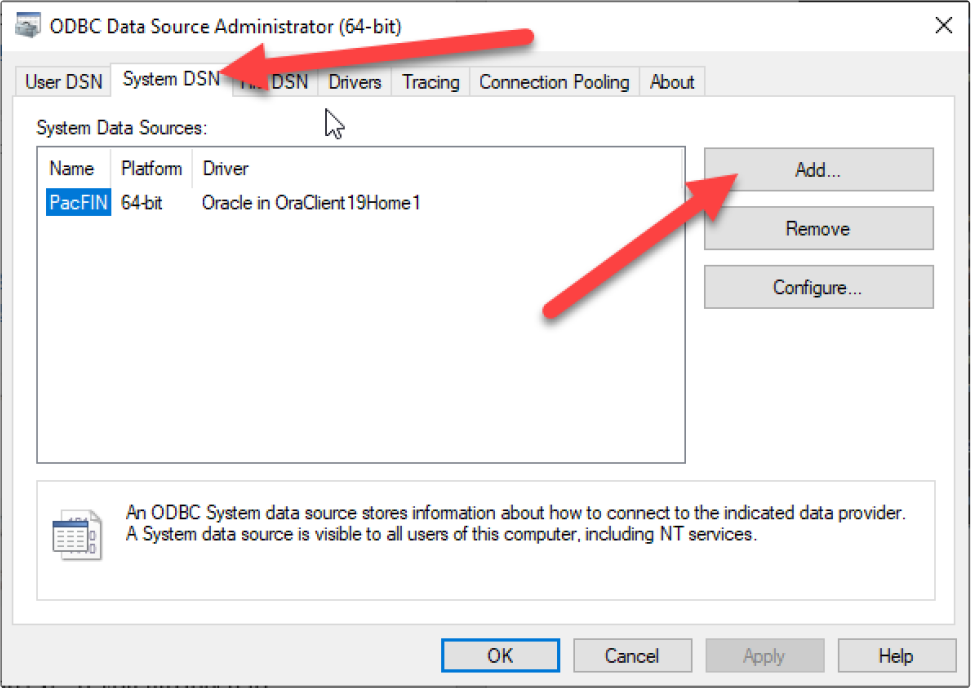
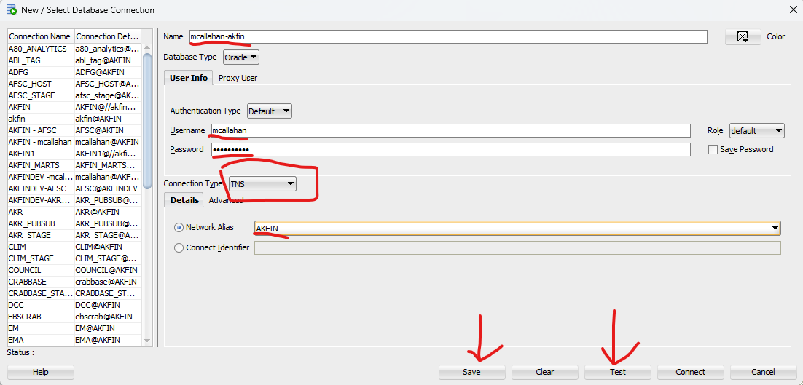
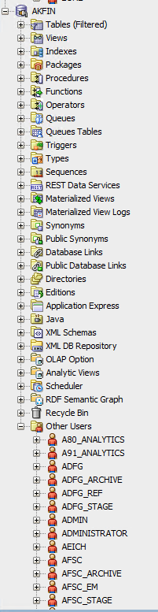
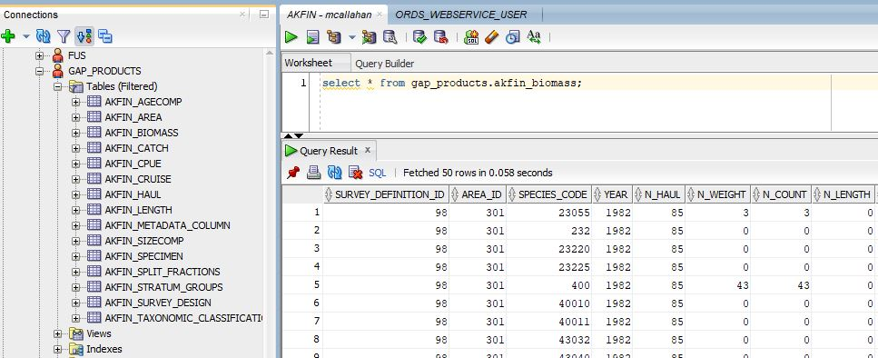
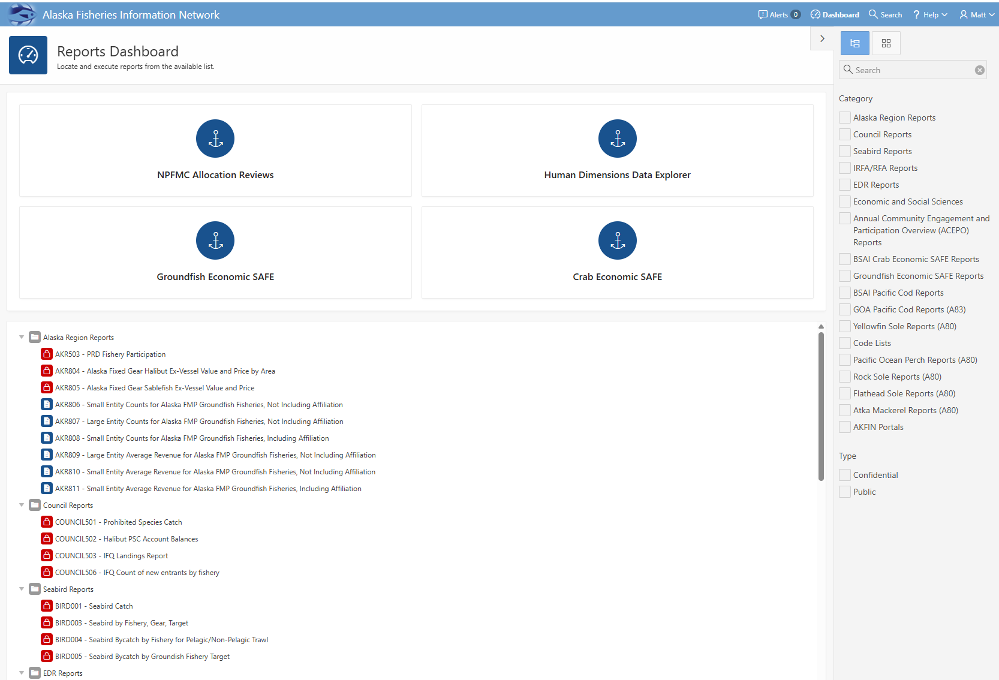
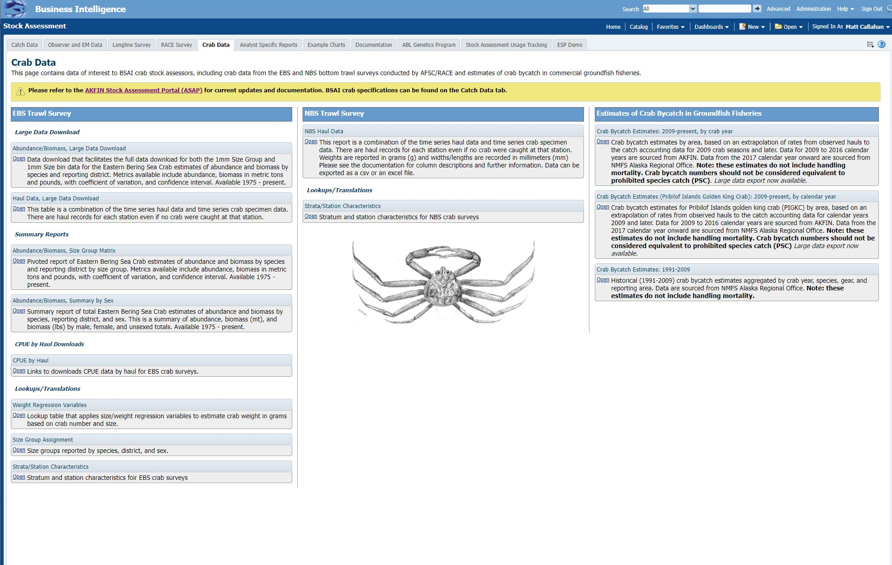

```{r, include = FALSE}
knitr::opts_chunk$set(
  collapse = TRUE,
  comment = "#>",
  fig.path = "man/figures/README-",
  out.width = "100%"
)
```

## Accessing data on AKFIN

<!-- badges: start -->
<!-- badges: end -->
The purpose of this document is to summarize and provide examples of the major ways that AKFIN users can obtain data from AKFIN.
The AKFIN database is a common source of data for AFSC stock assessment, NPFMC, and many other Alaskan Fisheries needs.
It is an Oracle database currently housed on a PSMFC server in Portland. 
AKFIN products pull data from the AKFIN database so regardless of which data access method is used, the same data is received.
This document will cover methods, strengths, and weaknesses of these data access pathways.
  1. Direct database connection through R or SQL developer.
  2. APEX reporting
  3. Web service (api)
  4. AKFIN ANSWERS


## AKFIN permissions
In order to be eligible to access confidential data on AKFIN, you must have an NDA on file at the NMFS Alaska regional office (AKR). Once your NDA is in place, you can request an AKFIN account [here](https://reports.psmfc.org/akfin/akfin/r/profile/request-account).

The credentials for a direct database connection and Oracle APEX are the same but  AKFIN ANSWERS is a separate account. Confidential web services also require a separate set of credentials. 


## Direct database connection
Users can connect to the database and pull data in SQL developer, R, or python while on PSMFC or NOAA networks of VPN. 
SQL developer is handy for designing SQL queries and examining table structure. Once a query is perfected, it can be reused in R, reproducibly pulling the latest data each time.
The [dbplyr](https://dbplyr.tidyverse.org/) R package also offers a tidyverse wrapper for SQL queries, which many users find helpful. 


Before connecting, users must complete the following steps. An AFSC helpdesk ticket might expedite this process and will be required without admin privileges.

* install oracle Database 19c Client (19.3) for Microsoft Windows x64 (64-bit) using the self service portal or it download [here](https://www.oracle.com/database/technologies/oracle19c-windows-downloads.html)
* Update tnsnames.ora file
  + Once the install is complete you will need to get the AKFIN connection information in a tnsnames.ora file. Contact AKFIN staff for the correct version of the file.
  + If you already have a tnsnames.ora file than the AKFIN connection will just need to be added.
* set up ODBC data sources (not needed for SQL developer but necessary for R)
  + Open windows tools and double click "ODBC Data Sources (64-bit)"
  + In the popup, select "System DSN" and click Add...

  + The next popup will vary some based on the services you have installed already. Look for the version titled "Oracle in OracleClient19Home1". Do not use a version with instant client in the title. 
  + In the config window enter Data Source Name – AKFIN, PacFIN or RecFIN based on service you are accessing. Description – up to you, but something to help you identify what it is. TNS server name is either akfin for Alaska data, or PacFIN for west coast commercial or recreational data (PacFIN and/or RecFIN). I leave the user ID blank. You can use scripts in R to automatically load your user ID and password. Click test and enter your user ID and password. If it passes click OK. If not please note error and contact staff to figure out the error








You can also connect using R. If I have a query that I am happy with that I know I will need to run repeatedly I will embed it in my R script. 

Below are some R examples. I use the odbc package to connect here but it is also possible to use the RODBC and RJDBC packages. RJDBC is ~3x faster than odbc or RODBC. The keyring and getPass packages allows us to enter passwords without storing them in code (poor form).

```{r message=FALSE}
library(tidyverse)
library(odbc)
library(getPass)
library(keyring)

# connect to AKFIN
con <- dbConnect(odbc::odbc(), "akfin", UID=key_list("akfin_oracle_db")$username, PWD = keyring::key_get("akfin_oracle_db", keyring::key_list("akfin_oracle_db")$username))

# If you don't use keyring use getpass and enter credentials
# con <- dbConnect(odbc::odbc(), "akfin", UID=getPass(msg="USER NAME"), PWD=getPass())

# query db for survey data
dbFetch(dbSendQuery(con, "select * from gap_products.akfin_biomass_v
                                  where rownum<10")) %>%
  rename_with(tolower)
```

You can also use the [afscdata package](https://github.com/afsc-assessments/afscdata). This was developed in 2023 and is designed to be flexible enough to pull data needed for assessments for each stock. This package uses the dbplyer package to translate dplyr filters into sql queries.

```{r}
#remotes::install_github("afsc-assessments/afscdata")
library(afscdata)

q_lls_rpn(year=2023, species=20510, area='ai', by='fmpsubarea', 
                      use_historical=FALSE, db=con, print_sql=FALSE, save=FALSE)
```

## APEX
AKFIN APEX (Application Express) reports are available [here](https://reports.psmfc.org/akfin/f?p=501:1000::::::). Log in with your oracle credentials by clicking public then login in the upper right to see confidential reports.


## Web servies
AKFIN can create web services (apis) to distribute data from a url. Web services do require a small amount of initial set up by AKFIN staff. They can be public or require authentication. Like a direct connection, a web service pull can be embedded in code and automated. They do not require NOAA network or VPN.

Authenticated web services require a "secret string", which is converted into an Oracle authentication token and included in the web service request. Reach out to AKFIN for a secret string if you do not already have one.

Example 1: SST in the Bering Sea:
```{r}
library(httr)
library(jsonlite)
library(keyring)

jsonlite::fromJSON(httr::content(
  httr::GET("https://apex.psmfc.org/akfin/data_marts/akmp/ecosystem_sub_crw_avg_sst?ecosystem_sub=Southeastern%20Bering%20Sea,Northern%20Bering%20Sea&start_date=20230314&end_date=20230315"),
  as = "text", encoding="UTF-8")) %>%
  bind_rows()

```

Example 2: Chinook PSC in the Bering Sea
```{r}
# Set secret string using keyring. You will only need to do this once.
#keyring::key_set(service="akfin_secret")

# Secret string text file needs to be in your working R directory
secret <- jsonlite::base64_enc( keyring::key_get("akfin_secret") )

# Get token from API
req <- httr::POST("https://apex.psmfc.org/akfin/data_marts/oauth/token",
                  httr::add_headers(
                    "Authorization" = paste("Basic", gsub("\n", "", secret)),
                    "Content-Type" = "application/x-www-form-urlencoded;charset=UTF-8"
                  ),
                  body = "grant_type=client_credentials"
);

#  Create authentication error message
httr::stop_for_status(req, "Something broke.")
token <- paste("Bearer", httr::content(req)$access_token)

## GOA Halibut PSC for 2023
start<-Sys.time()
fromJSON(content(
  GET('https://apex.psmfc.org/akfin/data_marts/akm/get_comprehensive_psc?startyear=2023&endyear=2023&fmp_area=GOA&species=HLBT',
      add_headers(Authorization = token)),
  as="text", encoding="UTF-8")) %>%
  bind_rows() %>%
  group_by(harvest_sector) %>%
  summarize(halbt_psc_mt= round(sum(pscnq_estimate),2))
end<-Sys.time()
end-start
```

I wrote the [akfingapdata](https://github.com/MattCallahan-NOAA/akfingapdata) R package to pull data from the new gap_products tables. Here is an example from that.

```{r message = FALSE}
# devtools::install_github("MattCallahan-NOAA/akfingapdata")
library(akfingapdata)

token<-create_token("Callahan_token.txt")

#pull GOA sablefish biomass 2015-2023
get_gap_biomass(species_code=20510, survey_definition_id = 47, area_id = 99903, start_year=2015, end_year = 2023)

```


## AKFIN Answers
[AKFIN Answers](https://akfinbi.psmfc.org/bi-security-login/login.jsp?msi=false&redirect=L2FuYWx5dGljcy9zYXcuZGxsP2JpZWVob21lJnN0YXJ0UGFnZT0xJmhhc2g9Y0MtckpJLUVnQUhzUlBtMDM5TWZBamZxdkctT0oydlhlc0VON0h2azlyeFFOSlZRZkNMTVlHYWRNdXRTcmF1Wg==) is an Oracle BI tool that allows users to browse, filter, and download data using a point and click web interface. 
Answers does not require any coding and it can be accessed without a VPN connection.
Answers is not the best method for reproducible science because users must select their filters and download their data as a csv each use. 


