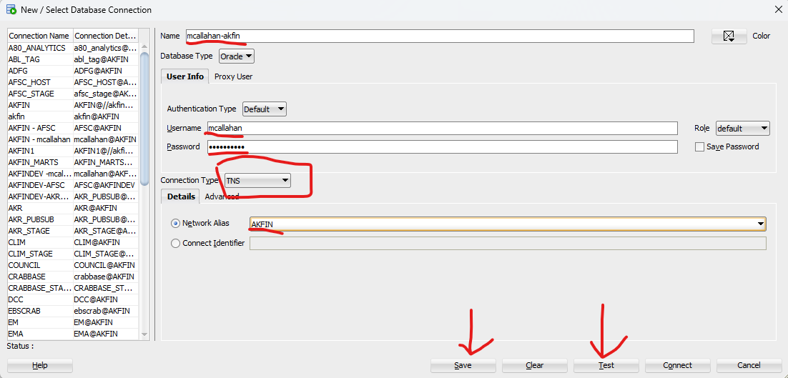

## Accessing data on AKFIN

<!-- badges: start -->
<!-- badges: end -->

The purpose of this document is to summarize and provide examples of the
major ways that AKFIN users can obtain data from AKFIN. The AKFIN
database is a common source of data for AFSC stock assessment, NPFMC,
and many other Alaskan Fisheries needs. It is an Oracle database
currently housed on a PSMFC server in Portland. AKFIN products pull data
from the AKFIN database so regardless of which data access method is
used, the same data is received. Here are the major ways that AKFIN
distributes data. 1) AKFIN ANSWERS 2) Direct database connection through
R or SQL developer. 3) Web service (api) 4) APEX reporting This document
will cover methods, strengths, and weaknesses of these data access
pathways.

## AKFIN permissions

In order to be eligible to access confidential data on AKFIN, you must
have an NDA on file the the NMFS Alaska regional office (AKR). Once your
NDA is in place, you can request and AKFIN account here.

Data access methods may have different sets of credentials. Your
AKFIN oracle database account is the same as your APEX report access but different from your AKFIN ANSWERS
login, and web services require a separate credentials
as well. Each access method will be covered in more detail below.

## AKFIN Answers

[AKFIN
Answers](https://akfinbi.psmfc.org/bi-security-login/login.jsp?msi=false&redirect=L2FuYWx5dGljcy9zYXcuZGxsP2JpZWVob21lJnN0YXJ0UGFnZT0xJmhhc2g9Y0MtckpJLUVnQUhzUlBtMDM5TWZBamZxdkctT0oydlhlc0VON0h2azlyeFFOSlZRZkNMTVlHYWRNdXRTcmF1Wg==)
is an Oracle BI tool that allows users to browse, filter, and download
data using a point and click web interface. Answers does not require any
coding and it can be accessed without a VPN connection. Answers is not
the best method for reproducible science because users must select their
filters and download their data as a csv each use.

<figure>

<figcaption aria-hidden="true">example report on Answers</figcaption>
</figure>

## Direct database connection

Users can connect to the database and pull data using SQL query. This
method requires VPN or NOAA network. Queries can be reused, pulling the
latest data each time, which makes this a reproducible method of
generating data. Before connecting, you will need to create a helpdesk
ticket for NOAA IT to add a tnsnames.ora file with the AKFIN oracle
connection to your computer.

You can use R or SQL developer to connect directly. SQL developer is
much more efficient for exploring the data tables. If you are new to
SQL, it’s more efficient to tweak your code in there before running it
in R.

<figure>

<figcaption aria-hidden="true">The first time you connect you will have
to specify some details, but you can save the connection so subsequent
logins will only require your password.</figcaption>
</figure>

<figure>

<figcaption aria-hidden="true">Once you get your AKFIN connection setup
it will look like this image. There are all these menus that you don’t
need to worry about. Counter-intuitively, the tables you seek are not
under “Tables”. Instead look under “Other Users.”</figcaption>
</figure>

<figure>

<figcaption aria-hidden="true">GAP_PRODUCTS tables in SQL
developer</figcaption>
</figure>

You can also connect using R. If I have a query that I am happy with
that I know I will need to run repeatedly I will embed it in my R
script.

Below are some R examples. I use the odbc package to collect here but it
is also possible to use the RODBC and RJDBC packages. The getPass
package allows us to enter passwords without storing them in code (poor
form).

``` r
library(tidyverse)
library(odbc)
library(getPass)

# connect to AKFIN
con <- dbConnect(odbc::odbc(), "akfin", UID=getPass(msg="USER NAME"), PWD=getPass())
#> Please enter password in TK window (Alt+Tab)
#> Please enter password in TK window (Alt+Tab)

# query db for norpac data
dbFetch(dbSendQuery(con, "select * from norpac.debriefed_spcomp
                                  where species=203
                    and rownum<10")) %>%
  rename_with(tolower)
#>   t_table cruise permit haul_seq    haul_join vessel  haul_date haul  sex
#> 1     ATL  14664   1607     2570 1.466400e+19   A255 2011-11-10  108 <NA>
#> 2     ATL  25461   2110        3 2.546100e+19   A077 2022-05-25  433 <NA>
#> 3     ATL  25461   2110       29 2.546100e+19   A077 2022-05-30  459 <NA>
#> 4     ATL  25461   2110       59 2.546100e+19   A077 2022-06-06  489 <NA>
#> 5     ATL  13458    438   129080 1.345800e+19   A273 2010-04-21    2 <NA>
#> 6     ATL  13458    438   129081 1.345800e+19   A273 2010-04-22    3 <NA>
#> 7     ATL  13458    438   129082 1.345800e+19   A273 2010-04-22    5 <NA>
#> 8     ATL  13801   5744   131861 1.380101e+19   A444 2010-11-04  393 <NA>
#> 9     ATL  13801   5744   131865 1.380101e+19   A444 2010-11-05  397 <NA>
#>   species         species_name sample_type sample_number sample_size
#> 1     203 SABLEFISH (BLACKCOD)           B             1       20086
#> 2     203 SABLEFISH (BLACKCOD)           B            25         168
#> 3     203 SABLEFISH (BLACKCOD)           B            20         100
#> 4     203 SABLEFISH (BLACKCOD)           B            14         148
#> 5     203 SABLEFISH (BLACKCOD)           B           400        1620
#> 6     203 SABLEFISH (BLACKCOD)           B           256        1620
#> 7     203 SABLEFISH (BLACKCOD)           B           371        1620
#> 8     203 SABLEFISH (BLACKCOD)           L            17         780
#> 9     203 SABLEFISH (BLACKCOD)           L            20         723
#>   sample_weight extrapolated_weight extrapolated_number percent_retained year
#> 1          5.38                8.27                   2              100 2011
#> 2         35.16             2195.93                1561                0 2022
#> 3         28.69              892.37                 622              100 2022
#> 4         27.38             1296.75                 663              100 2022
#> 5       1351.95             2705.19                 978              100 2010
#> 6        913.21             1973.76                 768               99 2010
#> 7       1256.07             2252.18                 866              100 2010
#> 8         71.28              204.26                  46               99 2010
#> 9         82.40              233.98                  57              100 2010
#>   date_of_entry     akfin_load_date
#> 1    2011-11-10 2024-03-10 23:45:01
#> 2    2022-07-20 2024-03-10 23:45:01
#> 3    2022-07-20 2024-03-10 23:45:01
#> 4    2022-07-20 2024-03-10 23:45:01
#> 5    2010-04-21 2024-03-10 23:45:01
#> 6    2010-04-22 2024-03-10 23:45:01
#> 7    2010-04-22 2024-03-10 23:45:01
#> 8    2010-11-04 2024-03-10 23:45:01
#> 9    2010-11-05 2024-03-10 23:45:01
```

You can also use the [afscdata
package](https://github.com/afsc-assessments/afscdata). This was
developed in 2023 and is designed to be flexible enough to pull data
needed for assessments for each stock. This package uses the dbplyer
package to translate dplyr filters into sql queries.

``` r
#remotes::install_github("afsc-assessments/afscdata")
library(afscdata)

q_lls_rpn(year=2023, species=20510, area='ai', by='fmpsubarea', 
                      use_historical=FALSE, db=con, print_sql=FALSE, save=FALSE)
#> sablefish rpns:
#> 
#>             -are corrected for sperm whale depredation and area summaries 
#> 
#>             -only include data from depth strata 3-7 (201-1000 m) 
#> 
#>             -use interpolated bs/ai values in alternating survey years when aggregated to the fmp or ak-wide level 
#> 
#>             -assume fixed rpn/rpw data in the ai (1990-1995) and bs (1990-1996) when no bs/ai surveys occurred
#> 
#>             -assume fixed ak-wide rpn/rpws from 1979-1994 for the historical Japanese survey
#> # A tibble: 34 × 14
#>     year country      council_management_a…¹ council_management_a…² species_code
#>    <dbl> <chr>                         <dbl> <chr>                         <dbl>
#>  1  1990 United Stat…                      1 Aleutians                     20510
#>  2  1991 United Stat…                      1 Aleutians                     20510
#>  3  1992 United Stat…                      1 Aleutians                     20510
#>  4  1993 United Stat…                      1 Aleutians                     20510
#>  5  1994 United Stat…                      1 Aleutians                     20510
#>  6  1995 United Stat…                      1 Aleutians                     20510
#>  7  1996 United Stat…                      1 Aleutians                     20510
#>  8  1997 United Stat…                      1 Aleutians                     20510
#>  9  1998 United Stat…                      1 Aleutians                     20510
#> 10  1999 United Stat…                      1 Aleutians                     20510
#> # ℹ 24 more rows
#> # ℹ abbreviated names: ¹​council_management_area_id, ²​council_management_area
#> # ℹ 9 more variables: species <chr>, cpue <dbl>, cpue_var <dbl>, rpn <dbl>,
#> #   rpn_var <dbl>, rpw <dbl>, rpw_var <dbl>, last_modified_date <dttm>,
#> #   akfin_load_date <dttm>
```

## Web servies

AKFIN can create web services (apis) to distribute data from a url. Web
services do require a small amount of initial set up by AKFIN staff.
They can be public or require authentication. Like a direct connection,
a web service pull can be embedded in code and automated. They do not
require NOAA network or VPN.

Authenticated web services require a “secret string”, which is converted
into an Oracle authentication token and included in the web service
request. Reach out to AKFIN for a secret string if you do not already
have one.

Example 1: SST in the Bering Sea:

``` r
library(httr)
library(jsonlite)
#> 
#> Attaching package: 'jsonlite'
#> The following object is masked from 'package:purrr':
#> 
#>     flatten
library(keyring)
#> Warning: package 'keyring' was built under R version 4.3.3

jsonlite::fromJSON(httr::content(
  httr::GET("https://apex.psmfc.org/akfin/data_marts/akmp/ecosystem_sub_crw_avg_sst?ecosystem_sub=Southeastern%20Bering%20Sea,Northern%20Bering%20Sea&start_date=20230314&end_date=20230315"),
  as = "text", encoding="UTF-8")) %>%
  bind_rows()
#>   MEANSST           ECOSYSTEM_SUB            READ_DATE YEAR JULIAN
#> 1   -1.64     Northern Bering Sea 2023-03-13T12:00:00Z 2023    072
#> 2    0.96 Southeastern Bering Sea 2023-03-13T12:00:00Z 2023    072
#> 3   -1.65     Northern Bering Sea 2023-03-14T12:00:00Z 2023    073
#> 4    0.87 Southeastern Bering Sea 2023-03-14T12:00:00Z 2023    073
```

Example 2: Chinook PSC in the Bering Sea

``` r
# Set secret string using keyring. You will only need to do this once.
#keyring::key_set(service="akfin_secret")

# Secret string text file needs to be in your working R directory
secret <- jsonlite::base64_enc( keyring::key_get("akfin_secret") )

# Get token from API
req <- httr::POST("https://apex.psmfc.org/akfin/data_marts/oauth/token",
                  httr::add_headers(
                    "Authorization" = paste("Basic", gsub("\n", "", secret)),
                    "Content-Type" = "application/x-www-form-urlencoded;charset=UTF-8"
                  ),
                  body = "grant_type=client_credentials"
);

#  Create authentication error message
httr::stop_for_status(req, "Something broke.")
token <- paste("Bearer", httr::content(req)$access_token)

## GOA Halibut PSC for 2023
start<-Sys.time()
fromJSON(content(
  GET('https://apex.psmfc.org/akfin/data_marts/akm/get_comprehensive_psc?startyear=2023&endyear=2023&fmp_area=GOA&species=HLBT',
      add_headers(Authorization = token)),
  as="text", encoding="UTF-8")) %>%
  bind_rows() %>%
  group_by(harvest_sector) %>%
  summarize(halbt_psc_mt= round(sum(pscnq_estimate),2))
#> # A tibble: 2 × 2
#>   harvest_sector halbt_psc_mt
#>   <chr>                 <dbl>
#> 1 CP                     438.
#> 2 CV                     476.
end<-Sys.time()
end-start
#> Time difference of 18.51859 secs
```

I wrote the
[akfingapdata](https://github.com/MattCallahan-NOAA/akfingapdata) R
package to pull data from the new gap_products tables. Here is an
example from that.

``` r
# devtools::install_github("MattCallahan-NOAA/akfingapdata")
library(akfingapdata)

token<-create_token("Callahan_token.txt")

#pull GOA sablefish biomass 2015-2023
get_gap_biomass(species_code=20510, survey_definition_id = 47, area_id = 99903, start_year=2015, end_year = 2023)
#>   survey_definition_id area_id species_code year n_haul n_weight n_count
#> 1                   47   99903        20510 2015    771      292     292
#> 2                   47   99903        20510 2017    536      300     300
#> 3                   47   99903        20510 2019    541      333     333
#> 4                   47   99903        20510 2021    529      305     305
#> 5                   47   99903        20510 2023    526      234     234
#>   n_length cpue_kgkm2_mean cpue_kgkm2_var cpue_nokm2_mean cpue_nokm2_var
#> 1      291        497.5280       1876.252        295.0174       1297.516
#> 2      300        467.8093       5320.431        452.0873       7735.663
#> 3      332        858.3070       4109.390        666.3847       3152.368
#> 4      305       1054.0152      10354.030        798.9722       6623.009
#> 5      233        634.0286       3541.078        404.6120       1241.430
#>   biomass_mt biomass_var population_count population_var      akfin_load_date
#> 1   159212.2   192135969         94407467   1.328710e+14 2024-02-16T00:46:14Z
#> 2   144279.9   506081889        139430982   7.358199e+14 2024-02-16T00:46:14Z
#> 3   264715.7   390887102        205523741   2.998548e+14 2024-02-16T00:46:14Z
#> 4   325075.2   984880265        246415859   6.299837e+14 2024-02-16T00:46:14Z
#> 5   195544.6   336828990        124788847   1.180854e+14 2024-02-16T00:46:14Z
```

## APEX

AKFIN has public APEX reports
[here](https://reports.psmfc.org/akfin/f?p=501:1000::::::).

## Shiny

AKFIN has a shiny server with some shiny apps
[here](https://shinyfin.psmfc.org/). You are welcome to add your own
apps too!
