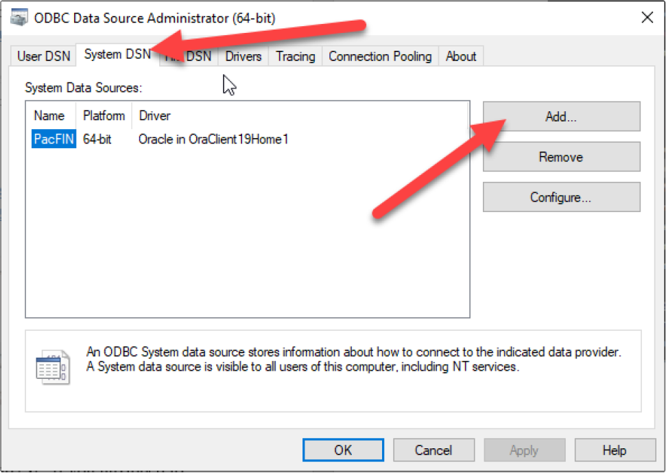
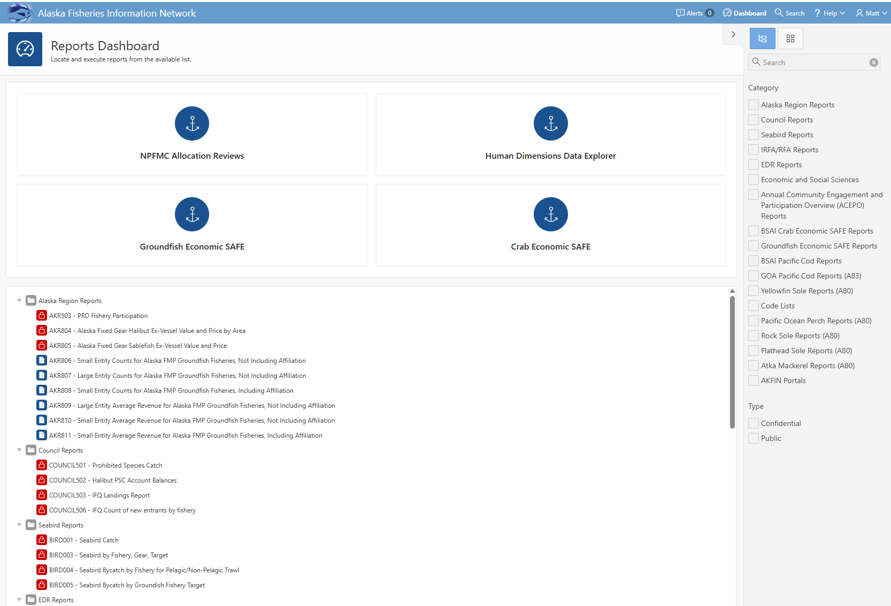

## Accessing data on AKFIN

<!-- badges: start -->

<!-- badges: end -->

The purpose of this document is to summarize and provide examples of the
major ways that AKFIN users can obtain data from AKFIN. The AKFIN
database is a common source of data for AFSC stock assessment, NPFMC,
and many other Alaskan Fisheries needs. It is an Oracle database
currently housed on a PSMFC server in Portland. AKFIN products pull data
from the AKFIN database so regardless of which data access method is
used, the same data is received. This document will cover methods,
strengths, and weaknesses of these data access pathways. 1. Direct
database connection through R or SQL developer. 2. APEX reporting 3. Web
service (api) 4. AKFIN ANSWERS

## AKFIN permissions

In order to be eligible to access confidential data on AKFIN, you must
have an NDA on file at the NMFS Alaska regional office (AKR). Once your
NDA is in place, you can request an AKFIN account
[here](https://reports.psmfc.org/akfin/akfin/r/profile/request-account).

The credentials for a direct database connection and Oracle APEX are the
same but AKFIN ANSWERS is a separate account. Confidential web services
also require a separate set of credentials.

## Direct database connection

Users can connect to the database and pull data in SQL developer, R, or
python while on PSMFC or NOAA networks of VPN. SQL developer is handy
for designing SQL queries and examining table structure. Once a query is
perfected, it can be reused in R, reproducibly pulling the latest data
each time.

### Configuration

Before connecting, users must complete the following steps. An AFSC
helpdesk ticket might expedite this process.

- install oracle Database 19c Client (19.3) for Microsoft Windows x64
  (64-bit) using the self service portal or it download
  [here](https://www.oracle.com/database/technologies/oracle19c-windows-downloads.html)
- Update tnsnames.ora file
  - Once the install is complete you will need to get the AKFIN
    connection information in a tnsnames.ora file. Contact AKFIN staff
    for the correct version of the file.
  - If you already have a tnsnames.ora file than the AKFIN connection
    will just need to be added.
- set up ODBC data sources (not needed for SQL developer but necessary
  for R)
  - Open windows tools and double click “ODBC Data Sources (64-bit)”
  - In the popup, select “System DSN” and click Add…
    
  - The next popup will vary some based on the services you have
    installed already. Look for the version titled “Oracle in
    OracleClient19Home1”. Do not use a version with instant client in
    the title.
  - In the config window enter Data Source Name – AKFIN, PacFIN or
    RecFIN based on service you are accessing. Description – up to you,
    but something to help you identify what it is. TNS server name is
    either akfin for Alaska data, or PacFIN for west coast commercial or
    recreational data (PacFIN and/or RecFIN). I leave the user ID blank.
    You can use scripts in R to automatically load your user ID and
    password. Click test and enter your user ID and password. If it
    passes click OK. If not please note error and contact staff to
    figure out the error

### Connecting through SQL developer

SQL developer is an interface for querying databases. Contact the AFSC
helpdesk for installation if not already installed. I use SQL developer
to see what tables are available, examine table structure, run quick
one-off queries, and develop more complex SQL queries before embedding
them into R scripts.

<figure>

<figcaption aria-hidden="true">The first time you connect you will have
to specify some details, but you can save the connection so subsequent
logins will only require your password.</figcaption>
</figure>

<figure>

<figcaption aria-hidden="true">Once you get your AKFIN connection setup
it will look like this image. There are all these menus that you don’t
need to worry about. Counter-intuitively, the tables you seek are not
under “Tables”. Instead look under “Other Users.”</figcaption>
</figure>

<figure>

<figcaption aria-hidden="true">GAP_PRODUCTS tables in SQL
developer</figcaption>
</figure>

### Connecting through R

You can also connect using R. Once a query has been perfected, coding it
into your scripts can pull it straight into your R environment. The
[dbplyr](https://dbplyr.tidyverse.org/) R package also offers a
tidyverse wrapper for SQL queries, which many users find helpful. Below
are some R examples. I use the odbc package and RJDBC packages to
connect here but it is also possible to use RODBC or ROracle. RJDBC is
~3x faster than odbc or RODBC. ROracle works for Mac users. The keyring
and getPass packages allows us to enter passwords without storing them
in code (poor form).

``` r
library(tidyverse)
library(odbc)
#> Warning: package 'odbc' was built under R version 4.4.1
```

``` r
library(getPass)
library(keyring)

# connect to AKFIN
con <- dbConnect(odbc::odbc(), "akfin", UID=key_list("akfin_oracle_db")$username, PWD = keyring::key_get("akfin_oracle_db", keyring::key_list("akfin_oracle_db")$username))

# If you don't use keyring use getpass and enter credentials
# con <- dbConnect(odbc::odbc(), "akfin", UID=getPass(msg="USER NAME"), PWD=getPass())

# query db for survey data
dbFetch(dbSendQuery(con, "select year, survey_definition_id, area_id, species_code, biomass_mt from gap_products.akfin_biomass_v
                                  where rownum<5")) %>%
  rename_with(tolower)
#>   year survey_definition_id area_id species_code biomass_mt
#> 1 1991                   52     823        20614          0
#> 2 1991                   52     824        20614          0
#> 3 1991                   52     991        20614          0
#> 4 1991                   52     992        20614          0
```

``` r
# RJDBC
library(RJDBC)
#> Loading required package: DBI
#> Loading required package: rJava
```

``` r

# specify jdbc driver location.
jdbcDriver <- JDBC(driverClass="oracle.jdbc.OracleDriver", classPath="java/ojdbc8.jar")

con_j <- dbConnect(jdbcDriver, 
                   "jdbc:oracle:thin:@//tiger:2045/akfin.psmfc.org", 
                   key_list("akfin_oracle_db")$username, 
                   keyring::key_get("akfin_oracle_db", keyring::key_list("akfin_oracle_db")$username))

dbGetQuery(con_j, paste0("select year, survey_definition_id, area_id, species_code, biomass_mt  from gap_products.akfin_biomass_v
                                  where rownum<5"))
#>   YEAR SURVEY_DEFINITION_ID AREA_ID SPECIES_CODE BIOMASS_MT
#> 1 1991                   52     823        20614          0
#> 2 1991                   52     824        20614          0
#> 3 1991                   52     991        20614          0
#> 4 1991                   52     992        20614          0
```

You can also use the [afscdata
package](https://github.com/afsc-assessments/afscdata). This was
developed in 2023 and is designed to be flexible enough to pull data
needed for assessments for each stock. This package uses the dbplyer
package.

``` r
#remotes::install_github("afsc-assessments/afscdata")
library(afscdata)

q_lls_rpn(year=2023, species=20510, area='ai', by='fmpsubarea', 
                      use_historical=FALSE, db=con, print_sql=FALSE, save=FALSE) %>%
  dplyr::select(year, council_management_area, species_code,rpn)
#> sablefish rpns:
#> 
#>             -are corrected for sperm whale depredation and area summaries 
#> 
#>             -only include data from depth strata 3-7 (201-1000 m) 
#> 
#>             -use interpolated bs/ai values in alternating survey years when aggregated to the fmp or ak-wide level 
#> 
#>             -assume fixed rpn/rpw data in the ai (1990-1995) and bs (1990-1996) when no bs/ai surveys occurred
#> 
#>             -assume fixed ak-wide rpn/rpws from 1979-1994 for the historical Japanese survey
#> # A tibble: 34 × 4
#>     year council_management_area species_code     rpn
#>    <dbl> <chr>                          <dbl>   <dbl>
#>  1  1990 Aleutians                      20510  77131.
#>  2  1991 Aleutians                      20510  74442.
#>  3  1992 Aleutians                      20510  50952.
#>  4  1993 Aleutians                      20510  78040.
#>  5  1994 Aleutians                      20510  56139.
#>  6  1995 Aleutians                      20510  57474.
#>  7  1996 Aleutians                      20510  57517 
#>  8  1997 Aleutians                      20510  55385 
#>  9  1998 Aleutians                      20510  98842.
#> 10  1999 Aleutians                      20510 108722.
#> # ℹ 24 more rows
```

## APEX

AKFIN APEX (Application Express) reports are available
[here](https://reports.psmfc.org/akfin/f?p=501:1000::::::). Log in with
your oracle credentials by clicking public then login in the upper right
to see confidential reports. 

## Web servies

AKFIN can create web services (apis) to distribute data from a url. Web
services do require a small amount of initial set up by AKFIN staff.
They can be public or require authentication. Like a direct connection,
a web service pull can be embedded in code and automated. They do not
require NOAA network or VPN.

Authenticated web services require a “secret string”, which is converted
into an Oracle authentication token and included in the web service
request. Reach out to AKFIN for a secret string if you do not already
have one. It will be in the format of client_id:password
(e.g. abcd..:1234..), and can be saved as a text file or added to your
keyring.

Example 1: Public api-SST in the Bering Sea:

``` r
library(httr)
library(jsonlite)
#> 
#> Attaching package: 'jsonlite'
#> The following object is masked from 'package:purrr':
#> 
#>     flatten
```

``` r
library(keyring)

jsonlite::fromJSON(httr::content(
  httr::GET("https://apex.psmfc.org/akfin/data_marts/akmp/ecosystem_sub_crw_avg_sst?ecosystem_sub=Southeastern%20Bering%20Sea,Northern%20Bering%20Sea&start_date=20230314&end_date=20230315"),
  as = "text", encoding="UTF-8")) %>%
  bind_rows()
#>   MEANSST           ECOSYSTEM_SUB            READ_DATE YEAR JULIAN
#> 1   -1.64     Northern Bering Sea 2023-03-13T12:00:00Z 2023    072
#> 2    0.96 Southeastern Bering Sea 2023-03-13T12:00:00Z 2023    072
#> 3   -1.65     Northern Bering Sea 2023-03-14T12:00:00Z 2023    073
#> 4    0.87 Southeastern Bering Sea 2023-03-14T12:00:00Z 2023    073
```

Example 2: Confidential data-Chinook PSC in the Bering Sea.

``` r
# Set secret string using keyring. You will only need to do this once.
#keyring::key_set(service="akfin_secret")

# Secret string text file needs to be in your working R directory
secret <- jsonlite::base64_enc( keyring::key_get("akfin_secret") )

# Get token from API
req <- httr::POST("https://apex.psmfc.org/akfin/data_marts/oauth/token",
                  httr::add_headers(
                    "Authorization" = paste("Basic", gsub("\n", "", secret)),
                    "Content-Type" = "application/x-www-form-urlencoded;charset=UTF-8"
                  ),
                  body = "grant_type=client_credentials"
);

#  Create authentication error message
httr::stop_for_status(req, "Something broke.")
token <- paste("Bearer", httr::content(req)$access_token)

## GOA Halibut PSC for 2023
start<-Sys.time()
fromJSON(content(
  GET('https://apex.psmfc.org/akfin/data_marts/akm/get_comprehensive_psc?startyear=2023&endyear=2023&fmp_area=GOA&species=HLBT',
      add_headers(Authorization = token)),
  as="text", encoding="UTF-8")) %>%
  bind_rows() %>%
  group_by(harvest_sector) %>%
  summarize(halbt_psc_mt= round(sum(pscnq_estimate),2))
#> # A tibble: 2 × 2
#>   harvest_sector halbt_psc_mt
#>   <chr>                 <dbl>
#> 1 CP                     438.
#> 2 CV                     477.
```

``` r
end<-Sys.time()
end-start
#> Time difference of 22.22719 secs
```

I wrote the
[akfingapdata](https://github.com/MattCallahan-NOAA/akfingapdata) R
package to pull data from the new gap_products tables. Here is an
example from that.

``` r
# devtools::install_github("MattCallahan-NOAA/akfingapdata")
library(akfingapdata)

token<-create_token("Callahan_token.txt")

#pull GOA sablefish biomass 2015-2023
get_gap_biomass(species_code=20510, survey_definition_id = 47, area_id = 99903, start_year=2015, end_year = 2023) %>%
  dplyr::select(year, survey_definition_id, area_id, species_code, biomass_mt)
#>   year survey_definition_id area_id species_code biomass_mt
#> 1 2015                   47   99903        20510   157921.4
#> 2 2017                   47   99903        20510   142977.0
#> 3 2019                   47   99903        20510   263799.5
#> 4 2021                   47   99903        20510   323811.1
#> 5 2023                   47   99903        20510   194026.4
```

## AKFIN Answers

[AKFIN
Answers](https://akfinbi.psmfc.org/bi-security-login/login.jsp?msi=false&redirect=L2FuYWx5dGljcy9zYXcuZGxsP2JpZWVob21lJnN0YXJ0UGFnZT0xJmhhc2g9Y0MtckpJLUVnQUhzUlBtMDM5TWZBamZxdkctT0oydlhlc0VON0h2azlyeFFOSlZRZkNMTVlHYWRNdXRTcmF1Wg==)
is an Oracle BI tool that allows users to browse, filter, and download
data using a point and click web interface. Answers does not require any
coding and it can be accessed without a VPN connection. Answers is not
the best method for reproducible science because users must select their
filters and download their data as a csv each use.

<figure>

<figcaption aria-hidden="true">example report on Answers</figcaption>
</figure>
