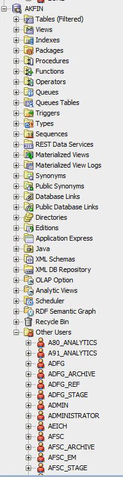

## Accessing data on AKFIN

<!-- badges: start -->

<!-- badges: end -->

The purpose of this document is to summarize and provide examples of the
major ways that AKFIN users can obtain data from AKFIN. The AKFIN
database is a common source of data for AFSC stock assessment, NPFMC,
and many other Alaskan Fisheries needs. It is an Oracle database
currently housed on a PSMFC server in Portland. AKFIN products pull data
from the AKFIN database so regardless of which data access method is
used, the same data is received. This document will cover methods,
strengths, and weaknesses of these data access pathways. 1. Direct
database connection through R or SQL developer. 2. APEX reporting 3. Web
service (api) 4. AKFIN ANSWERS

## AKFIN permissions

In order to be eligible to access confidential data on AKFIN, you must
have an NDA on file at the NMFS Alaska regional office (AKR). Once your
NDA is in place, you can request an AKFIN account
[here](https://reports.psmfc.org/akfin/akfin/r/profile/request-account).

The credentials for a direct database connection and Oracle APEX are the
same but AKFIN ANSWERS is a separate account. Confidential web services
also require a separate set of credentials.

## Direct database connection

Users can connect to the database and pull data in SQL developer, R, or
python while on PSMFC or NOAA networks of VPN. SQL developer is handy
for designing SQL queries and examining table structure. Once a query is
perfected, it can be reused in R, reproducibly pulling the latest data
each time. The [dbplyr](https://dbplyr.tidyverse.org/) R package also
offers a tidyverse wrapper for SQL queries, which many users find
helpful.

Before connecting, users must complete the following steps. An AFSC
helpdesk ticket might expedite this process and will be required without
admin privileges.

- install oracle Database 19c Client (19.3) for Microsoft Windows x64
  (64-bit) using the self service portal or it download
  [here](https://www.oracle.com/database/technologies/oracle19c-windows-downloads.html)
- Update tnsnames.ora file
  - Once the install is complete you will need to get the AKFIN
    connection information in a tnsnames.ora file. Contact AKFIN staff
    for the correct version of the file.
  - If you already have a tnsnames.ora file than the AKFIN connection
    will just need to be added.
- set up ODBC data sources (not needed for SQL developer but necessary
  for R)
  - Open windows tools and double click “ODBC Data Sources (64-bit)”
  - In the popup, select “System DSN” and click Add…
    
  - The next popup will vary some based on the services you have
    installed already. Look for the version titled “Oracle in
    OracleClient19Home1”. Do not use a version with instant client in
    the title.
  - In the config window enter Data Source Name – AKFIN, PacFIN or
    RecFIN based on service you are accessing. Description – up to you,
    but something to help you identify what it is. TNS server name is
    either akfin for Alaska data, or PacFIN for west coast commercial or
    recreational data (PacFIN and/or RecFIN). I leave the user ID blank.
    You can use scripts in R to automatically load your user ID and
    password. Click test and enter your user ID and password. If it
    passes click OK. If not please note error and contact staff to
    figure out the error

<figure>

<figcaption aria-hidden="true">The first time you connect you will have
to specify some details, but you can save the connection so subsequent
logins will only require your password.</figcaption>
</figure>

<figure>

<figcaption aria-hidden="true">Once you get your AKFIN connection setup
it will look like this image. There are all these menus that you don’t
need to worry about. Counter-intuitively, the tables you seek are not
under “Tables”. Instead look under “Other Users.”</figcaption>
</figure>

<figure>

<figcaption aria-hidden="true">GAP_PRODUCTS tables in SQL
developer</figcaption>
</figure>

You can also connect using R. If I have a query that I am happy with
that I know I will need to run repeatedly I will embed it in my R
script.

Below are some R examples. I use the odbc package to connect here but it
is also possible to use the RODBC and RJDBC packages. RJDBC is ~3x
faster than odbc or RODBC. The keyring and getPass packages allows us to
enter passwords without storing them in code (poor form).

``` r
library(tidyverse)
library(odbc)
#> Warning: package 'odbc' was built under R version 4.4.1
```

``` r
library(getPass)
library(keyring)

# connect to AKFIN
con <- dbConnect(odbc::odbc(), "akfin", UID=key_list("akfin_oracle_db")$username, PWD = keyring::key_get("akfin_oracle_db", keyring::key_list("akfin_oracle_db")$username))

# If you don't use keyring use getpass and enter credentials
# con <- dbConnect(odbc::odbc(), "akfin", UID=getPass(msg="USER NAME"), PWD=getPass())

# query db for survey data
dbFetch(dbSendQuery(con, "select * from gap_products.akfin_biomass_v
                                  where rownum<10")) %>%
  rename_with(tolower)
#>                            survey_name survey_definition_id year area_id
#> 1 Aleutian Islands Bottom Trawl Survey                   52 1991     823
#> 2 Aleutian Islands Bottom Trawl Survey                   52 1991     824
#> 3 Aleutian Islands Bottom Trawl Survey                   52 1991     991
#> 4 Aleutian Islands Bottom Trawl Survey                   52 1991     992
#> 5 Aleutian Islands Bottom Trawl Survey                   52 1991     993
#> 6 Aleutian Islands Bottom Trawl Survey                   52 1991     994
#> 7 Aleutian Islands Bottom Trawl Survey                   52 1991    3491
#> 8 Aleutian Islands Bottom Trawl Survey                   52 1991    3492
#> 9 Aleutian Islands Bottom Trawl Survey                   52 1991    3493
#>   species_code n_haul n_weight n_count n_length cpue_kgkm2_mean cpue_kgkm2_var
#> 1        20614      2        0       0        0        0.000000       0.000000
#> 2        20614      4        0       0        0        0.000000       0.000000
#> 3        20614     66        0       0        0        0.000000       0.000000
#> 4        20614    160        0       0        0        0.000000       0.000000
#> 5        20614     60        0       0        0        0.000000       0.000000
#> 6        20614     45        1       1        0        0.135175       0.018272
#> 7        20614     16        0       0        0        0.000000       0.000000
#> 8        20614     44        0       0        0        0.000000       0.000000
#> 9        20614     20        0       0        0        0.000000       0.000000
#>   cpue_nokm2_mean cpue_nokm2_var biomass_mt biomass_var population_count
#> 1         0.00000        0.00000   0.000000    0.000000                0
#> 2         0.00000        0.00000   0.000000    0.000000                0
#> 3         0.00000        0.00000   0.000000    0.000000                0
#> 4         0.00000        0.00000   0.000000    0.000000                0
#> 5         0.00000        0.00000   0.000000    0.000000                0
#> 6         3.47878       12.10191   1.889661    3.570818            48631
#> 7         0.00000        0.00000   0.000000    0.000000                0
#> 8         0.00000        0.00000   0.000000    0.000000                0
#> 9         0.00000        0.00000   0.000000    0.000000                0
#>   population_var         common_name species_name                area_type
#> 1              0 deepsea smelt unid. Bathylagidae REGULATORY AREA BY DEPTH
#> 2              0 deepsea smelt unid. Bathylagidae REGULATORY AREA BY DEPTH
#> 3              0 deepsea smelt unid. Bathylagidae                    DEPTH
#> 4              0 deepsea smelt unid. Bathylagidae                    DEPTH
#> 5              0 deepsea smelt unid. Bathylagidae                    DEPTH
#> 6     2364971947 deepsea smelt unid. Bathylagidae                    DEPTH
#> 7              0 deepsea smelt unid. Bathylagidae           INPFC BY DEPTH
#> 8              0 deepsea smelt unid. Bathylagidae           INPFC BY DEPTH
#> 9              0 deepsea smelt unid. Bathylagidae           INPFC BY DEPTH
#>   survey_code depth_min_m depth_max_m           area_name
#> 1          AI         201         300 Southern Bering Sea
#> 2          AI         301         500 Southern Bering Sea
#> 3          AI           1         100                 All
#> 4          AI         101         200                 All
#> 5          AI         201         300                 All
#> 6          AI         301         500                 All
#> 7          AI           1         100   Central Aleutians
#> 8          AI         101         200   Central Aleutians
#> 9          AI         201         300   Central Aleutians
#>                  area_description area_km2 design_year region regulatory_area
#> 1      S BERING SEA 201 m - 300 m       NA        1991   <NA>            <NA>
#> 2      S BERING SEA 301 m - 500 m       NA        1991   <NA>            <NA>
#> 3          All areas 1-100 meters       NA        1991   <NA>            <NA>
#> 4        All areas 101-200 meters       NA        1991   <NA>            <NA>
#> 5        All areas 201-300 meters       NA        1991   <NA>            <NA>
#> 6        All areas 301-500 meters       NA        1991   <NA>            <NA>
#> 7   Central Aleutians 1 m - 100 m       NA        1991   <NA>            <NA>
#> 8 Central Aleutians 101 m - 200 m       NA        1991   <NA>            <NA>
#> 9 Central Aleutians 201 m - 300 m       NA        1991   <NA>            <NA>
#>   inpfc_by_depth inpfc depth nmfs_statistical_area regulatory_area_by_depth
#> 1           <NA>  <NA>  <NA>                  <NA>                     <NA>
#> 2           <NA>  <NA>  <NA>                  <NA>                     <NA>
#> 3           <NA>  <NA>  <NA>                  <NA>                     <NA>
#> 4           <NA>  <NA>  <NA>                  <NA>                     <NA>
#> 5           <NA>  <NA>  <NA>                  <NA>                     <NA>
#> 6           <NA>  <NA>  <NA>                  <NA>                     <NA>
#> 7           <NA>  <NA>  <NA>                  <NA>                     <NA>
#> 8           <NA>  <NA>  <NA>                  <NA>                     <NA>
#> 9           <NA>  <NA>  <NA>                  <NA>                     <NA>
#>   subarea akfin_load_date                   code_name stock
#> 1    <NA>      2025-07-15 20614 - deepsea smelt unid.    NA
#> 2    <NA>      2025-07-15 20614 - deepsea smelt unid.    NA
#> 3    <NA>      2025-07-15 20614 - deepsea smelt unid.    NA
#> 4    <NA>      2025-07-15 20614 - deepsea smelt unid.    NA
#> 5    <NA>      2025-07-15 20614 - deepsea smelt unid.    NA
#> 6    <NA>      2025-07-15 20614 - deepsea smelt unid.    NA
#> 7    <NA>      2025-07-15 20614 - deepsea smelt unid.    NA
#> 8    <NA>      2025-07-15 20614 - deepsea smelt unid.    NA
#> 9    <NA>      2025-07-15 20614 - deepsea smelt unid.    NA
```

You can also use the [afscdata
package](https://github.com/afsc-assessments/afscdata). This was
developed in 2023 and is designed to be flexible enough to pull data
needed for assessments for each stock. This package uses the dbplyer
package to translate dplyr filters into sql queries.

``` r
#remotes::install_github("afsc-assessments/afscdata")
library(afscdata)

q_lls_rpn(year=2023, species=20510, area='ai', by='fmpsubarea', 
                      use_historical=FALSE, db=con, print_sql=FALSE, save=FALSE)
#> sablefish rpns:
#> 
#>             -are corrected for sperm whale depredation and area summaries 
#> 
#>             -only include data from depth strata 3-7 (201-1000 m) 
#> 
#>             -use interpolated bs/ai values in alternating survey years when aggregated to the fmp or ak-wide level 
#> 
#>             -assume fixed rpn/rpw data in the ai (1990-1995) and bs (1990-1996) when no bs/ai surveys occurred
#> 
#>             -assume fixed ak-wide rpn/rpws from 1979-1994 for the historical Japanese survey
#> # A tibble: 34 × 14
#>     year country      council_management_a…¹ council_management_a…² species_code
#>    <dbl> <chr>                         <dbl> <chr>                         <dbl>
#>  1  1990 United Stat…                      1 Aleutians                     20510
#>  2  1991 United Stat…                      1 Aleutians                     20510
#>  3  1992 United Stat…                      1 Aleutians                     20510
#>  4  1993 United Stat…                      1 Aleutians                     20510
#>  5  1994 United Stat…                      1 Aleutians                     20510
#>  6  1995 United Stat…                      1 Aleutians                     20510
#>  7  1996 United Stat…                      1 Aleutians                     20510
#>  8  1997 United Stat…                      1 Aleutians                     20510
#>  9  1998 United Stat…                      1 Aleutians                     20510
#> 10  1999 United Stat…                      1 Aleutians                     20510
#> # ℹ 24 more rows
#> # ℹ abbreviated names: ¹​council_management_area_id, ²​council_management_area
#> # ℹ 9 more variables: species <chr>, cpue <dbl>, cpue_var <dbl>, rpn <dbl>,
#> #   rpn_var <dbl>, rpw <dbl>, rpw_var <dbl>, last_modified_date <dttm>,
#> #   akfin_load_date <dttm>
```

## APEX

AKFIN APEX (Application Express) reports are available
[here](https://reports.psmfc.org/akfin/f?p=501:1000::::::). Log in with
your oracle credentials by clicking public then login in the upper right
to see confidential reports. 

## Web servies

AKFIN can create web services (apis) to distribute data from a url. Web
services do require a small amount of initial set up by AKFIN staff.
They can be public or require authentication. Like a direct connection,
a web service pull can be embedded in code and automated. They do not
require NOAA network or VPN.

Authenticated web services require a “secret string”, which is converted
into an Oracle authentication token and included in the web service
request. Reach out to AKFIN for a secret string if you do not already
have one.

Example 1: SST in the Bering Sea:

``` r
library(httr)
library(jsonlite)
#> 
#> Attaching package: 'jsonlite'
#> The following object is masked from 'package:purrr':
#> 
#>     flatten
```

``` r
library(keyring)

jsonlite::fromJSON(httr::content(
  httr::GET("https://apex.psmfc.org/akfin/data_marts/akmp/ecosystem_sub_crw_avg_sst?ecosystem_sub=Southeastern%20Bering%20Sea,Northern%20Bering%20Sea&start_date=20230314&end_date=20230315"),
  as = "text", encoding="UTF-8")) %>%
  bind_rows()
#>   MEANSST           ECOSYSTEM_SUB            READ_DATE YEAR JULIAN
#> 1   -1.64     Northern Bering Sea 2023-03-13T12:00:00Z 2023    072
#> 2    0.96 Southeastern Bering Sea 2023-03-13T12:00:00Z 2023    072
#> 3   -1.65     Northern Bering Sea 2023-03-14T12:00:00Z 2023    073
#> 4    0.87 Southeastern Bering Sea 2023-03-14T12:00:00Z 2023    073
```

Example 2: Chinook PSC in the Bering Sea

``` r
# Set secret string using keyring. You will only need to do this once.
#keyring::key_set(service="akfin_secret")

# Secret string text file needs to be in your working R directory
secret <- jsonlite::base64_enc( keyring::key_get("akfin_secret") )

# Get token from API
req <- httr::POST("https://apex.psmfc.org/akfin/data_marts/oauth/token",
                  httr::add_headers(
                    "Authorization" = paste("Basic", gsub("\n", "", secret)),
                    "Content-Type" = "application/x-www-form-urlencoded;charset=UTF-8"
                  ),
                  body = "grant_type=client_credentials"
);

#  Create authentication error message
httr::stop_for_status(req, "Something broke.")
token <- paste("Bearer", httr::content(req)$access_token)

## GOA Halibut PSC for 2023
start<-Sys.time()
fromJSON(content(
  GET('https://apex.psmfc.org/akfin/data_marts/akm/get_comprehensive_psc?startyear=2023&endyear=2023&fmp_area=GOA&species=HLBT',
      add_headers(Authorization = token)),
  as="text", encoding="UTF-8")) %>%
  bind_rows() %>%
  group_by(harvest_sector) %>%
  summarize(halbt_psc_mt= round(sum(pscnq_estimate),2))
#> # A tibble: 2 × 2
#>   harvest_sector halbt_psc_mt
#>   <chr>                 <dbl>
#> 1 CP                     438.
#> 2 CV                     477.
```

``` r
end<-Sys.time()
end-start
#> Time difference of 23.49117 secs
```

I wrote the
[akfingapdata](https://github.com/MattCallahan-NOAA/akfingapdata) R
package to pull data from the new gap_products tables. Here is an
example from that.

``` r
# devtools::install_github("MattCallahan-NOAA/akfingapdata")
library(akfingapdata)

token<-create_token("Callahan_token.txt")

#pull GOA sablefish biomass 2015-2023
get_gap_biomass(species_code=20510, survey_definition_id = 47, area_id = 99903, start_year=2015, end_year = 2023)
#>   survey_definition_id area_id species_code year n_haul n_weight n_count
#> 1                   47   99903        20510 2015    767      290     290
#> 2                   47   99903        20510 2017    535      299     299
#> 3                   47   99903        20510 2019    537      333     333
#> 4                   47   99903        20510 2021    526      302     302
#> 5                   47   99903        20510 2023    523      234     234
#>   n_length cpue_kgkm2_mean cpue_kgkm2_var cpue_nokm2_mean cpue_nokm2_var
#> 1      289        500.5296       1914.260        294.6634       1312.217
#> 2      299        470.4378       5313.223        454.5731       7782.235
#> 3      332        867.9807       4213.603        673.4023       3229.017
#> 4      302       1065.4370      10629.448        806.6154       6810.373
#> 5      233        638.4060       3633.389        408.0715       1271.143
#>   biomass_mt biomass_var population_count population_var      akfin_load_date
#> 1   157921.4   190556278         92968842   1.306255e+14 2025-07-15T00:00:00Z
#> 2   142977.0   490778967        138155343   7.188400e+14 2025-07-15T00:00:00Z
#> 3   263799.5   389207740        204662618   2.982622e+14 2025-07-15T00:00:00Z
#> 4   323811.1   981835196        245149196   6.290697e+14 2025-07-15T00:00:00Z
#> 5   194026.4   335613822        124022433   1.174147e+14 2025-07-15T00:00:00Z
```

## AKFIN Answers

[AKFIN
Answers](https://akfinbi.psmfc.org/bi-security-login/login.jsp?msi=false&redirect=L2FuYWx5dGljcy9zYXcuZGxsP2JpZWVob21lJnN0YXJ0UGFnZT0xJmhhc2g9Y0MtckpJLUVnQUhzUlBtMDM5TWZBamZxdkctT0oydlhlc0VON0h2azlyeFFOSlZRZkNMTVlHYWRNdXRTcmF1Wg==)
is an Oracle BI tool that allows users to browse, filter, and download
data using a point and click web interface. Answers does not require any
coding and it can be accessed without a VPN connection. Answers is not
the best method for reproducible science because users must select their
filters and download their data as a csv each use.

<figure>

<figcaption aria-hidden="true">example report on Answers</figcaption>
</figure>
